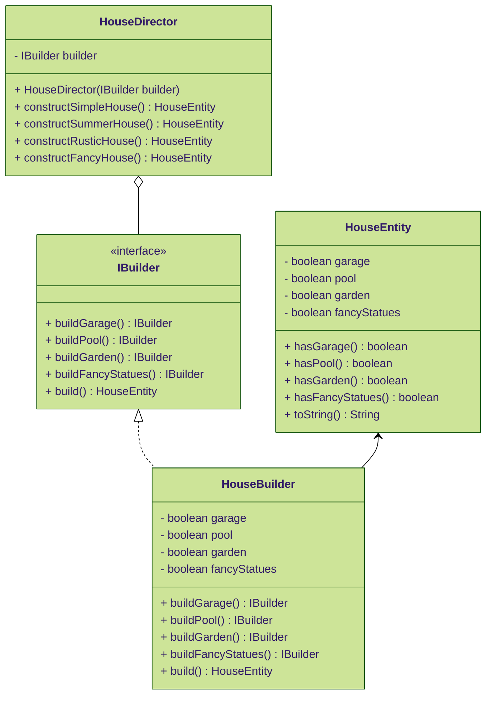
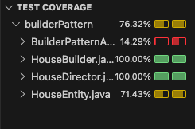

# 🏗 Builder pattern

## 🏘 About
Starting from the "House" entity, I had to implement the Builder design pattern to allow the "House" entity to construct different types of houses. Each type of house should represent a specific combination of attributes (garage, garden, pool and fancy statues).

## 📈 Class diagram

## 🧪 Test coverage

